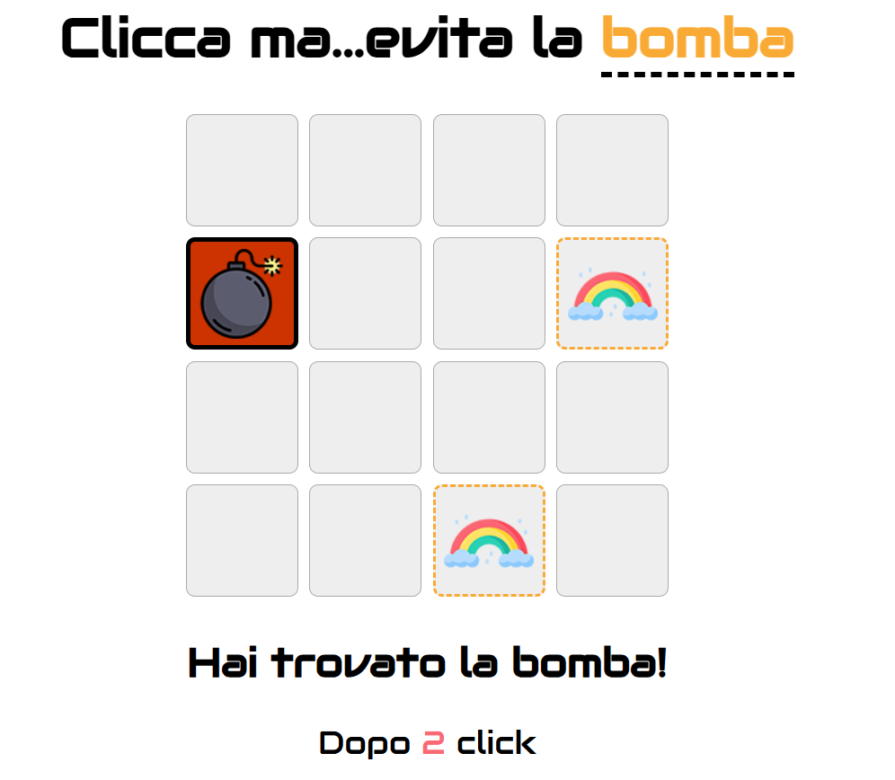

🇮🇹 ITALIAN: Gioco "evita la bomba": il gioco va avanti sino a che non si trova la bomba, a quel punto si ferma il gioco ed esce fuori con messaggio di fine gioco. HTML e CSS gia' fornito, mi sono solo occupata del
codice Javascript.

💻JAVASCRIPT: Ho arricchito il codice di implementazioni nel design direttamente inserite sul file app.js. A caricamento della pagina un ciclo for crea i 16 li dei quadratini della pulsantiera del gioco, nel 
frattempo viene estratto un numero casuale nella funzione Numero() con Math.floor(Math.random()*16) e inserita nella variabile esterna num per essere usata per decidere dove va a posizionarsi la bomba. Un secondo
ciclo individua in quale li viene fatto il click e comparato con quello nella variabile num. 
Se corrisponde si inserisce l'immagine della bomba e si attivano le due funzioni: bomba() che inserisce il messaggio di fine gioco e partita(), che permette di far ricominciare il gioco ricaricando la pagina.
Se non corrisponde prima di tutto si controlla se e' gia' stata cliccata (se e' gia' presente l'arcobaleno al suo interno), e se cosi non fosse si inserisce l'immagine e si aggiorna il contatore 
della variabile conta (che serve per contare i click si fanno prima di trovare la bomba).

🇬🇧 ENGLISH: "Don't find the bomb" game: the game goes on until the bomb is found, at which point the game stops and comes out with an end-of-game message. HTML and CSS was already provided, I just took care of the
Javascript code.

💻JAVASCRIPT: I have added few design features inside the Javascript code inside the the app.js file. When the page loads, a for loop creates the 16 li of the squares of the game's control panel, meanwhile, 
a random number is extracted in the Number() function with Math.floor(Math.random()*16) and inserted into the outer variable num, that it is used to decide where the bomb goes. A second loop identifies which one 
is clicked and compares it to the one inside the num variable. If it matches, the image of the bomb is inserted and two functions are activated: bomba() which inserts the end-game message and partita(), 
which allows you to restart the game by reloading the page.
If it doesn't match, first of all check if it has already been clicked (if there is already the picture of a rainbow inside it), and if it doesn't, insert the image and update the counter of the variable count 
(which is used to conto the clicks made before finding the bomb).
